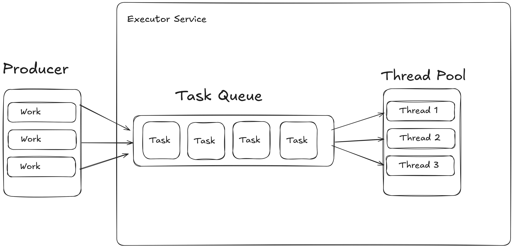

<h2><center>Memahami Konsep Java Basic Threadpool </center></h2>
Pada kesempatan kali ini, saya ingin berbagi pengalaman terkait Java Basic ThreadPool. Pengetahuan ini saya peroleh saat mengerjakan tugas di kantor, dimana saya diminta untuk membuat konfigurasi untuk thread pool yang akan digunakan dalam aplikasi. Dalam artikel ini, saya akan menjelaskan tentang hal dasar tentang ThreadPool dan bagaimana cara membuatnya .

<h2>Apa itu Threadpool</h2>
ThreadPool adalah sekumpulan thread yang digunakan untuk menjalankan tugas-tugas secara paralel. Dengan adanya thread pool, pengelolaan thread pada aplikasi Java menjadi lebih efisien. Thread pool memberikan beberapa keuntungan, seperti:

- Meminimalkan overhead dalam membuat dan menghancurkan thread secara dinamis.
- Membatasi jumlah thread yang berjalan bersamaan sehingga mencegah konsumsi sumber daya yang berlebihan.
- Memudahkan monitoring dan pengelolaan thread yang aktif.

Melalui thread pool, kita dapat:

- Menentukan jumlah maksimum thread yang dapat berjalan bersamaan.
- Memantau status thread yang sedang berjalan, termasuk jumlah thread aktif.


<h2> Perumpaaan Threadpool</h2>
Bayangkan Anda memiliki restoran dengan lima koki. Jika ada sepuluh pesanan makanan yang datang, hanya lima pesanan yang bisa langsung dimasak oleh koki yang tersedia. Sisanya akan menunggu di antrian hingga ada koki yang selesai dan siap mengerjakan pesanan berikutnya. Itulah cara kerja thread pool, di mana sejumlah thread bekerja seperti koki dalam menangani tugas-tugas secara paralel.

<h2>Diagram ThreadPool</h2>



Diagram di atas menunjukkan tiga bagian utama dalam thread pool:

1. Producer: Membuat tugas baru yang akan ditambahkan ke antrian.
2. Task Queue: Merupakan sebuah antrian yang menyimpan tugas-tugas yang belum selesai.
3. Worker Thread Pool: Menjalankan tugas-tugas yang ada di antrian.

Alur kerja thread pool adalah sebagai berikut:

1. Producer membuat tugas baru dan menambahkannya ke antrian.
2. Worker thread mengambil tugas dari antrian dan menjalankan tugas tersebut.
3. Producer dan worker thread bergerak terus-menerus untuk menyelesaikan tugas-tugas yang ada di antrian.

<h2>Implementasi Dasar Thread Pool</h2>

```java
import java.util.concurrent.*;

public class ThreadPoolRunnable {
    public static void main(String[] args) {
        ExecutorService executor = Executors.newFixedThreadPool(5);

        for (int i = 1; i <= 10; i++) {
            int taskId = i;
            System.out.println("Submitting task " + taskId);
            executor.execute(() -> {
                System.out.println("Thread " + Thread.currentThread().getName() + " is running task " + taskId);
                try {
                    Thread.sleep(1000); // Simulate task execution
                } catch (InterruptedException e) {
                    Thread.currentThread().interrupt();
                }
            });
        }

        executor.shutdown();
        try {
            if (!executor.awaitTermination(60, TimeUnit.SECONDS)) {
                executor.shutdownNow();
            }
        } catch (InterruptedException e) {
            executor.shutdownNow();
        }

        System.out.println("All tasks completed!");
    }
}

```

<h2>Penjelasan Kode</h2>

<h3>1. Membuat ExecutorService</h3>

```java
ExecutorService executor = Executors.newFixedThreadPool(5);
```
Membuat `ExecutorService` dengan menggunakan `Executors.newFixedThreadPool(5)`, yang berarti kita membuat thread pool dengan kapasitas tetap sebanyak 5 thread. Ini memungkinkan kita untuk menjalankan hingga 5 tugas secara bersamaan.


<h3>2. Loop untuk Menyubmit Tugas</h3>

```java
for (int i = 1; i <= 10; i++) {
    int taskId = i;
    System.out.println("Submitting task " + taskId);
```
Loop ini akan mengulangi dari 1 hingga 10, di mana setiap iterasi mewakili sebuah tugas yang akan disubmit ke thread pool. taskId menyimpan ID tugas saat ini.

<h3>3. Menyubmit Tugas ke Executor</h3>

```java
executor.execute(() -> {
    System.out.println("Thread " + Thread.currentThread().getName() + " is running task " + taskId);
    try {
        Thread.sleep(1000); // Simulate task execution
    } catch (InterruptedException e) {
        Thread.currentThread().interrupt();
    }
});
```

<h3>4. Menutup ExecutorService</h3>

```java
executor.shutdown();
```
Setelah semua tugas disubmit, kita memanggil `executor.shutdown()` untuk menghentikan penerimaan tugas baru dan memulai proses shutdown dari executor.

<h3>5. Menunggu Penyelesaian Tugas </h3>

```java
try {
    if (!executor.awaitTermination(60, TimeUnit.SECONDS)) {
        executor.shutdownNow();
    }
} catch (InterruptedException e) {
    executor.shutdownNow();
}
```
Kita mencoba untuk menunggu hingga semua tugas selesai dalam waktu 60 detik dengan `executor.awaitTermination()`. Jika waktu habis dan masih ada tugas yang berjalan, kita memanggil `executor.shutdownNow()` untuk menghentikan semua tugas yang sedang berjalan.
Jika thread utama diinterupsi saat menunggu, kita juga memanggil `executor.shutdownNow()`.

<h2>Penutup</h2>
Itulah penjelasan dasar tentang ThreadPool di Java. Dengan thread pool, pengelolaan tugas paralel menjadi lebih mudah dan efisien. Contoh di atas menunjukkan bagaimana kita dapat membuat thread pool, menyubmit tugas, serta mengelola proses eksekusi dengan baik. Semoga artikel ini membantu Anda memahami konsep dan implementasi thread pool di aplikasi Java. Apabila ada pertanyaan maupun ada saran, saya terima dengan senang hati.


<h3> Referensi </h3>

- https://www.baeldung.com/java-thread-pool

- https://jenkov.com/tutorials/java-concurrency/thread-pools.html
