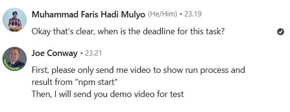

<h1>
⚠️Scam Interview di Linkedin ⚠️
</h1>

<h2>Cerita Singkat </h2>

Kemarin malam, saya menerima pesan dari seseorang di LinkedIn yang menawarkan pekerjaan kontrak terkait blockchain. Awalnya, saya merasa ini adalah peluang menarik untuk mulai terjun ke dunia blockchain. Namun, setelah melalui beberapa langkah, saya menyadari ini adalah modus penipuan. Berikut kronologinya. 

<h2> Awal Kejadian </h2>

Saat pertama kali menerima tawaran ini, saya tidak merasa curiga. Saya bahkan menganggap ini sebagai kesempatan bagus bagi saya yang baru belajar blockchain. Singkat cerita, saya menyetujui tawaran tersebut. Setelah itu, pelaku mengirimkan tautan repository (repo) dan meminta saya untuk meng-clone repo tersebut

 setelah dikirimkannya repo sersebut saya bertanya mengenai deadline, disini saya sudah mulai curiga, karena saya teringat beberapa postingan di Linkedin supaya lebih berhati hati jika menerima tawaran project dimana kita harus melakukan running project tersebut terlebih dahulu. 

Disin pelaku mengharapkan saya mengirimkan video setelah berhasil menjalankan project tersebut, akan tetapi <i>tidak semudah itu ferguso </i> 😂.
 

<h2>Analisis repository</h2>

Saya teringat oleh postingan mas Aditya Irwansyah pada postingan ini https://sohay666.github.io/article/reversing-scam-interview-base-on-js-project.html , dimana mas Aditya mengalami hal serupa, jadi ada kemungkinan disini terdapat sebuah code yang di <i>obfuscate</i> , dan benar saja terdapat kode yang di <i>obfuscate</i> pada file `error.js`

### Proses Deobfuscate
Saya menggunakan [obf-io.deobfuscate.io](https://obf-io.deobfuscate.io/) untuk men-<i>deobfuscate</i> kode tersebut. Hasilnya, saya menemukan file yang strukturnya mirip dengan yang dijelaskan dalam postingan Mas Aditya. Meski peletakan file berbeda, kode di dalamnya hampir sama.

kemudian saya pun mencoba melakuakn <i>whois lookup</i> pada ip yang tertera pada kode tersebut dimana mendapatkkan hasil seperti ini

## Perbandingan dengan modus sebelumnya 

Setelah membandingkan kode dari repo ini dengan file yang dianalisis Mas Aditya, terlihat jelas bahwa ini berasal dari pelaku yang sama. Bedanya, IP yang digunakan sekarang berubah dari `86.104.74.51` menjadi `185.153.182.241`.

Selanjutnya saya mencoba membandingkan dengan file yang ada pada postingan mas Aditya lainnya, kemudian saya mendapatkan hasil seperti ini

Berikut adalah kode dari mas Aditya

ini adalah kode yang saya dapatkan

Disitu bisa dilihat memilki kemiripan yang hampir sama, dengan beberapa kode yang telah dirubah. 

 Karena saya tidak terlalu paham dalam melakukan reverse engineering, saya hanya bisa membandingkan hasilnya saja. Teman teman bisa melihat cara reverse engineer pada [potingan mas aditya](https://sohay666.github.io/article/reversing-scam-interview-base-on-js-project.html). 
 
 Buat teman-teman yang mau melakukan serangan balik tempat dan waktu dipersilahkan , jika ingin melihat untuk repo nya ada di link berikut https://bitbucket.org/vodafone3/tradingview_project.git/src. 
 > Catatan penting: Jangan coba menjalankan repo ini!, gunakan vm sebagai bahan uji coba anda .  Jika repo sudah dihapus, mungkin saya akan mengunggah file malware-nya untuk yang ingin menganalisis lebih dalam.

## Pelajaran Berharga
Pelaku mungkin menargetkan pemula seperti saya, dengan harapan saya tergiur tawaran uang besar dan gegabah dalam mengambil keputusan. Namun, berkat kehati-hatian dan referensi dari orang lain, Alhamdulillah saya berhasil menghindari scam ini.

Sayangnya, sebelum sempat memberi pesan <i>bijak</i> kepada pelaku, akun saya langsung diblokir. 🤣

## Tips Untuk Teman-teman
1. <b>Hati-hati dengan tawaran di LinkedIn atau platform lainnya.</b> Jangan langsung percaya, terutama jika proyeknya meminta Anda menjalankan kode tanpa penjelasan jelas.
   
2. <b>Periksa repo sebelum menjalankan kode.</b> Jika ada file yang di-obfuscate, berhati-hatilah.
   
3. <b>Cari referensi online.</b> Pengalaman orang lain bisa menjadi pembelajaran untuk kita semua.

Semoga cerita ini membantu teman-teman agar lebih waspada, terutama bagi yang baru memulai karier di bidang teknologi seperti blockchain ataupun bidang lainnya. Jangan mudah tergiur dan tetap jaga keamanan data Anda. 😊